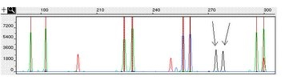

# Microsat Allele Detector (2007)
An automated program designed to detect allele peaks in genescan files for population genetics studies. 

_Problem_: I need to find the molecular weights of sample peaks in hundreds of genescan files in a way that is both accurate and consistent.

_Solution_: A program that creates a simple excel sheet that contains all peak Molecular Weights and information.

## About the Microsat Allele Detector

This program was designed while I worked for a population genetics lab at Penn State in 2007. My supervisor needed a program that could read genescan traces generated by a micro-satellite allele analysis to determine the prominant allele frequencies in a way that was quick, accurate, and consistent. To accomplish this task, I spent the next few months honing my Perl programming ability, learning how to interface with DNA sequence machine data files, and finding ways to teach a program to objectively call results that are sometimes difficult to determine by hand. It was quite a challenge, but what resulted was a program that outperformed even my initial expectations and saved my supervisor countless hours of tedious labor.

## How It Works (a brief overview)

The program starts by asking a series of questions about the location of the data files, trace dye names, and the expected allele size. It then loads a user-customizable configuration file and starts the analysis. Traces are smoothed and cleaned using various Gaussian and averaging smoothers, and thresholded to remove values associated with noise. The next step is the hardest. It involves determining the base pair values of peaks in the standard trace which can vary quite significantly (0bp peak can be missing, peak height and spacing may changet, sample peaks may 'bleed' into the standard, etc.). After standard base pair values have been established, the program looks for significant peaks within the expected range and determines the most likely alleles. All allele data is written to an excel spreadsheet, and detailed information and errors are written to a log. The program can also generated individual trace images and will generate a frequency graph of all alleles. A separate Perl script then imports the output excel spreadsheet into the main database, allowing the user to make changes before data is written. Specific information on output can be found in the protocol file below. 

## How It Performs

A test was performed on over 150 samples, comparing the program's allele calls with those of lab members. Non-critical errors (due to noisy input) were generated in roughly 15% of files, and critical errors (one's requiring manual verification) in about 5%. I estimate that the program will have 1 false positive (an incorrect allele call) in about 500 samples, and 1 false negative (a missing allele call) in 100. I designed the program to be as conservative as possible, so samples that encounter errors will fail rather than generate false positives or negatives. Still, the program is not perfect, and neither is any data set. These numbers are very rough, and more testing is needed to completely verify these results. 

## The Program

THIS PROGRAM IS DISTRIBUTED AS IS. USE AT YOUR OWN RISK. Feel free to see how different configurations perform for your data. There is no support provided with this software, but feel free to email me about any specific questions or concerns. I am always interested to hear feedback.
